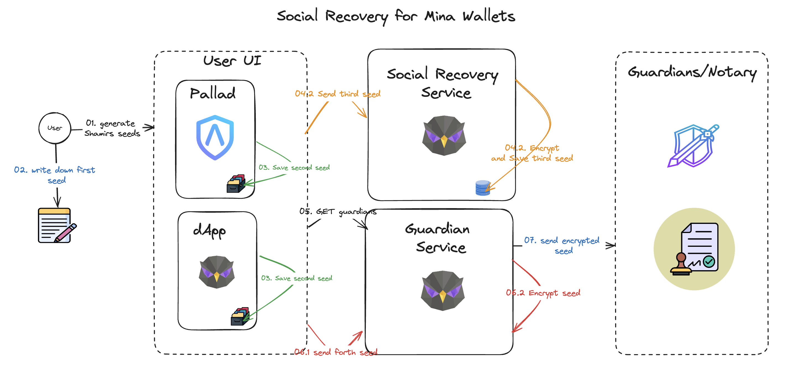
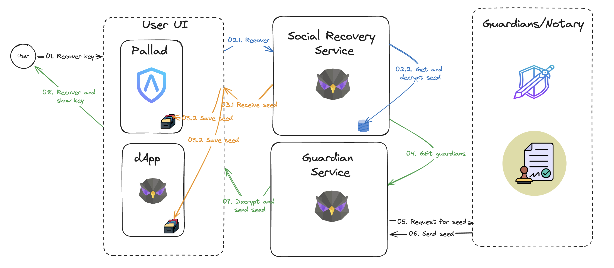

# Secure Social Recovery service for Blockchain Wallets
[Proposal link](https://zkignite.minaprotocol.com/zkignite/dev-tooling-infra-cohort-3_104/draftproposals/suggestion/637)

## Summary
Introducing a revolutionary Social Recovery Service for blockchain private keys, designed to combine cutting-edge security with ease of use.

Our solution uses client-side encryption and Shamir's Secret Sharing to split and distribute key shares among trusted guardians, ensuring that users never lose access to their digital assets. The service is built on a community-driven, open-source platform, offering robust protection against quantum computing threats and ensuring user control in key recovery. With a focus on user education and a user-friendly interface, our service bridges the gap between advanced security and accessibility, making it an ideal choice for both individual users and enterprises. This innovative approach not only enhances security but also promotes a collaborative and resilient digital asset management ecosystem.

## Problem Statement
In the realm of blockchain and cryptocurrency, losing access to private keys can result in irreversible loss of assets. Traditional recovery methods, like seed phrases, are prone to risks like theft, loss, or damage. There is a need for a more secure, user-friendly, and resilient method for key recovery.

## Solution
Implement a Social Recovery Service that uses a combination of client-side encryption, key splitting, and a trusted network of guardians. This system enhances security, reduces the risk of key loss, and provides a more accessible recovery process for users.

# Architecture
1. System Components:
User UI: A client application where users manage their private keys and interact with the Social Recovery and Guardian Services.
Social Recovery Service: A server-side application that facilitates the recovery process without accessing actual key shares.
Guardian Service: Manages a network of trusted contacts (guardians) designated by the user.

2. Key Management:
Keys are split using Shamir's Secret Sharing and distributed among guardians.
Client-side encryption ensures keys are never exposed in plaintext outside the user’s device.
 
3. Communication:
All communications are end-to-end encrypted using quantum-resistant algorithms.

### Interaction Between Components
**User UI**:
- **Key Generation and Encryption:**
    - Users create their private keys within the User UI.
    - The keys are then encrypted locally on the user’s device for added security.
- **Key Splitting and Threshold Setting:**
    - The encrypted key is split into multiple shares using Shamir's Secret Sharing algorithm.
    - Users set a threshold (minimum of 3 shares) required for key recovery.
- **Display and Storage of Shares:**
    - All generated shares (seeds) are displayed to the user.
    - Seed NR1 is saved locally on the user’s device for security and convenience.
    - Seed NR2 is made available for the user to download and store externally as a backup.
- **Transmission to Social Recovery service:**
    - Seed NR3 is securely transmitted to Social Recovery Service. - Seed NR3 is encrypted and save securely in it's database
- **Transmission to Guardians:**
    - The remaining shares is securely transmitted to the Guardian Service. This transmission is encrypted and secure.
- **Interaction with Guardian Service:**
    - The User UI interfaces with the Guardian Service to facilitate the distribution of shares to designated guardians.

### Social Recovery Service:
1. **Coordination of Recovery Process:**
    - Upon a user's request for key recovery, the Social Recovery Service coordinates the process.
    - It manages the communication and logistics involved in recovering the necessary key shares.
2. **User Authentication:**
    - Implements multi-factor authentication to verify the identity of the user before initiating the recovery process.
3. **Encryption and Storage of Seed:**
    - Encrypts and securely stores Seed NR3 in its database, ensuring it's available for recovery when needed.

### Guardian Service:
1. **Request Handling:**
    - Manages requests sent to guardians for their part of the key shares.
2. **Secure Transmission of Shares:**
    - Upon receiving a recovery request, the service securely obtains the necessary shares from the guardians.
    - These shares are then securely transmitted back to the user for recombination and key recovery.
3. **System Security and User Experience:**
    - End-to-End Encryption: All communications within the system, including the transmission of key shares, are end-to-end encrypted using quantum-resistant algorithms.
    - User Interface Design: The User UI is designed for ease of use, with clear instructions and a straightforward process for generating, saving, and transmitting key shares.
    - Security Protocols: Both the Social Recovery Service and Guardian Service employ robust security protocols to protect the shares and the users' private keys.

This interaction model ensures a secure and efficient process for managing and recovering blockchain private keys, while also being user-friendly and accessible.

## Vision and Project Longevity
- **Community-Driven and Open Source:** Encourages transparency, trust, and continuous improvement through community contributions.
- **Longevity:** Regular updates and adaptability to emerging cryptographic threats ensure the system remains relevant and secure.

## Business Model
- **Freemium Model:** Basic services for free with premium features for advanced users or enterprises.
- **Consulting and Support:** Provide expert services for setup, customization, and ongoing support.
- **Partnerships:** Collaborate with blockchain platforms or wallet providers.

## Risks and Mitigation
 
1. **User Compliance and Education:** Provide comprehensive user education on secure key management practices. Simplify the user interface to make it intuitive for non-technical users.
2. **Technological Advancements:** Regularly update the system to keep up with advancements in quantum computing and cryptography.
3. **Security Vulnerabilities:** Conduct ongoing security audits and penetration testing to identify and address vulnerabilities.
3. **Data Privacy Laws:** Ensure compliance with global data privacy regulations by implementing strict data handling and processing policies.

**Community and Open Source Software**
- **Community Involvement:** Encourage community participation in development, testing, and feedback, fostering a collaborative environment for improvement.
- **Open Source Code:** Ensure transparency and trust by making the codebase publicly available. This approach also allows for community-driven security audits and enhancements.

**User Experience**
- **Ease of Use:** The client UI is designed to be simple yet effective, allowing users to easily encode their keys and send shares to contacts.
- **Guardian Interaction:** Guardians can effortlessly receive and send shares to facilitate key recovery, ensuring a smooth process for all parties involved.

**Security of Shares and Keys**
- **Secure Storage:** Employ the highest standards of security for storing shares and keys, including encryption at rest and in transit.
- **Access Control:** Implement strict access control measures to prevent unauthorized access to key shares.